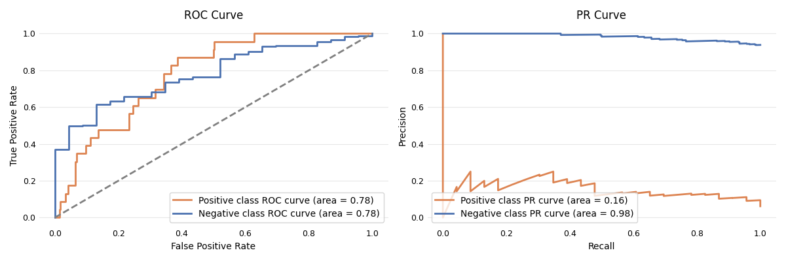
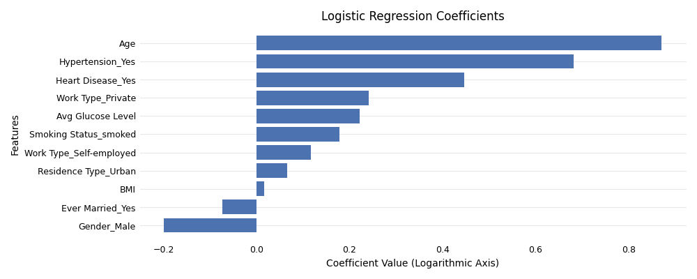
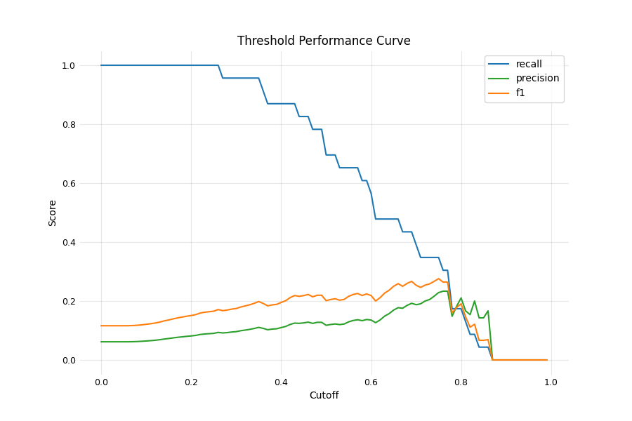

# Stroke Prediction


## Dataset

The dataset for this project can be found on [Kaggle](https://www.kaggle.com/datasets/fedesoriano/stroke-prediction-dataset) (licensed under CC0: Data files © Original Authors).

The dataset comprises information about individuals stroke history, along with predictors like age, hypertension, heart disease, smoking, and diabetes. However, it lacks important factors such as high cholesterol, physical inactivity, diet, alcohol use, family history, and job stress, all of which also impact stroke risk. These missing factors, combined with the weak connection between the included features and stroke, limit the performance of predictive models. Additionally, the dataset’s brief description leaves many details about data collection and preprocessing unclear. Some feature values are unrealistic, raising concerns about the data's overall reliability.

The sampling methods of this dataset were probably non random, but for the purposes of this project, I will assume it was random to apply statistical inference methods.

## Objectives

The main objective of this project is:

> **Develop a binary classification model that can predict if a person is likely to have a stroke.**

To evaluate model effectiveness, I have chosen the PR AUC score. While both PR AUC and F1 are suitable for imbalanced datasets, the F1 score evaluates the balance between precision and recall at a single threshold. In contrast, PR AUC provides a more informative assessment by considering all possible thresholds.

To achieve this objective, the project was broken down into the following sub-objectives:

1. Perform exploratory data analysis and document insights.
2. Engineer new predictive features.
3. Select and develop a well-performing classification model.
4. Create and deploy an API endpoint for the trained model.

## Insights Based on EDA

Statistically significant predictors of stroke supported by domain knowledge:

- Old age is the strongest factor for having a stroke.
- People with high blood pressure are more likely to have a stroke.
- Patients with heart disease are more likely to have a stroke.
- People with high glucose levels are more likely to have a stroke.
- Individuals with higher body fat are more likely to have a stroke.

Statistically significant associations not supported by domain knowledge:

- People who are married are more likely to have a stroke. There is no evidence that being married increases the risk of stroke; it may actually provide protective benefits.

No statistically significant associations:

- No association between gender and stroke. This is a nuanced connection, with men having a higher risk at younger ages and women having a higher risk at older ages. Women also face unique risk factors such as pregnancy and hormonal changes.
- Residence type is also not connected to stroke, confirming general understanding.

Variables with multiple groups requiring further statistical hypothesis testing with associations unsupported by domain knowledge:

- Self-employed individuals seem to have a higher chance of a stroke, but this is likely influenced by other factors and not directly supported by domain knowledge.
- Former smokers are the most likely to have a stroke, contrary to the expectation that current smokers would have the highest risk.

## Engineered Features

Based on the strongest associations between stroke and individual predictors identified during EDA, higher-order terms and interaction features were created to capture non-linear relationships. Additionally, some numeric variables were converted into categorical bins.

Interaction terms:
- Age * Hypertension
- Age * Heart Disease
- Age * Avg Glucose Level
- Hypertension * Heart Disease

Higher order terms:
- Age<sup>2</sup>
- (Avg Glucose Level)<sup>2</sup>

Numeric conversion to categorical:
- Age Group (35-60, 61-80, 81+)
- BMI Category (Underweight, Normal, Overweight, Obese)

Ultimately, these new features were not useful, as they added a very small improvement in the performance of different models.

## Model Selection

The algorithms tested were SVM, KNN, Logistic Regression, Random Forest, Gradient Boosting, XGBoost, CatBoost, and LightGBM. The best performing model is Logistic Regression with the following parameters:

```json
{
    "classifier__C": 0.02,
    "classifier__class_weight": "balanced",
    "classifier__penalty": "l2",
    "classifier__solver": "lbfgs"
}

```



In terms of PR AUC, Logistic Regression performed very similarly to Gradient Boosting, with both models typically outperforming others by a few hundredths, such as 0.03 or 0.04. Of the two, logistic Regression is more interpretable and the less complex.

### Model Explainability



Selected model shows a logical distribution of feature importance, with age, hypertension, heart disease, and average glucose level as the top predictors of stroke, which aligns with their established roles as significant risk factors. However, the positive association of non-smoking with stroke risk is unexpected. Work type has a low coefficient, which is appropriate, as self-employment should not be highly influential. Interestingly, BMI shows a negative influence on stroke risk, whereas it is expected to have a positive impact. The reduced stroke risk associated with being male is not inconsistent with existing research.

## Business Metrics

<div align="center">
    
</div>

A different threshold can be selected based on specific requirements.

## Local Deployment

My assumption is that the model would receive the data in its original form as it is on Kaggle except for ID number.

### Step 1: Run the FastAPI App

Clone the repository, go to deployment folder and use Uvicorn to run the FastAPI app:

```shell
uvicorn fastapi_model_server:app --reload
```
This command starts a local server.

### Step 2: Test the API

You can test the API endpoints directly from your browser, by going to:

```shell
http://127.0.0.1:8000/docs
```
Here you can send a POST request to the /predict/ endpoint with JSON data. The folder contains an example.
